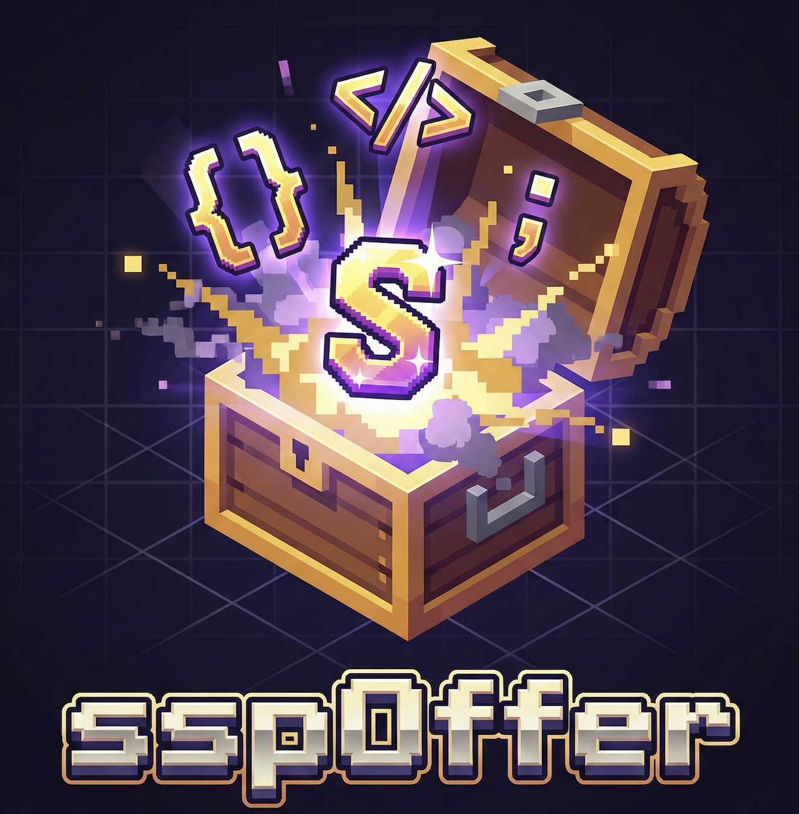

# 

**sspOffer 面经助手** · 互联网面试准备一站式平台  
本地安装即用：桌面端一键启动 / `mvn spring-boot:run` 起 Web / `npm install -g sspoffer` 起 CLI

基于 LangChain4j + Spring Boot + React + Electron 的面经整合与 AI 面试准备应用。支持面经搜索、AI 面试模拟（RAG + 深挖题 + 连续追问 + 整场评分 + 历史对比）、面试复盘、在线算法 IDE、**实习项目概念掌握度闭环**，并通过 Function Calling 让大模型自动调用「查面经 / 查算法题 / 运行代码 / 统计高频考点」等后端能力。

同一套代码提供 **3 种使用形态**：

| 形态 | 适合谁 | 启动方式 |
|------|--------|----------|
| **桌面端（推荐）** | 个人 Mac/Windows 用户 | 一键安装包 / 源码 `npm run dev` |
| **Web 端** | 想直接用浏览器、部署到服务器分享 | `mvn spring-boot:run`，前端走 `classpath:/static/` |
| **npm CLI** | 装在任意机器的命令行启动器 | `npm install -g sspoffer` 然后 `sspoffer` |

---

## 目录

- [快速开始](#快速开始)
  - [A. 桌面端（Electron，一键安装包）](#a-桌面端electron一键安装包)
  - [B. Web 端（直接 `mvn spring-boot:run`）](#b-web-端直接-mvn-spring-bootrun)
  - [C. npm CLI（`npm install -g sspoffer`）](#c-npm-clinpm-install-g-sspoffer)
- [功能特性](#功能特性)
- [技术栈](#技术栈)
- [动态模型配置](#动态模型配置设置页)
- [评分体系](#评分体系)
- [Skill Pack 架构](#skill-pack-架构)
- [主要接口](#主要接口)
- [打包与部署](#打包与部署)
- [项目结构](#项目结构)
- [文档索引](#文档索引)
- [License](#license)

---

## 快速开始

### A. 桌面端（Electron，一键安装包）

> 桌面端是同源代码 + Electron 壳，**自带 Java 后端 + React 前端 + Piston 代码执行 + 可选语音输入**。
> macOS / Windows 都可以；Linux 需要自己跑 dev 模式。

#### A1. 直接安装预编译包（最快）

```bash
# macOS（Apple Silicon / Intel）
brew install --cask sspoffer     # 或从 GitHub Releases 下载 sspOffer.app

# Windows：下载 GitHub Releases 的 sspOffer-Setup.exe 双击安装
```

> 没发布包时，本地一键打包：`./pack-sspoffer.sh` → 产出 `sspoffer-0.1.0.tgz`（含 jlink 定制 JRE 17 + Spring Boot jar + Electron 壳），`npm install -g sspoffer-0.1.0.tgz && sspoffer`。

#### A2. 源码开发模式（推荐用于二次开发）

前置：本机已装 [JDK 17+](https://adoptium.net/) 与 Node.js 20+。

```bash
git clone https://github.com/alvinxx1123/sspOffer-interview-assistant.git
cd sspOffer-interview-assistant

# 一次性安装依赖（前后端 + electron + cli）
cd frontend && npm install && cd ..
(cd electron && npm install)
(cd cli && npm install)

# 一键起：后端 + Electron 桌面端
./dev.sh
# 或手动：
#   终端 1：mvn spring-boot:run
#   终端 2：cd electron && npm run dev
```

首次启动会在 `~/.sspoffer/.env` 写入示例配置（已 gitignore），你填入以下任一 key：

```text
# LLM（默认走 DeepSeek，可换成任意 OpenAI 兼容服务）
LLM_API_KEY=sk-...
LLM_BASE_URL=https://api.deepseek.com
LLM_MODEL=deepseek-v4-flash

# RAG Embedding（默认走智谱；未填也能启动，仅 RAG 向量检索不可用，会降级为纯关键词搜索）
EMBEDDING_API_KEY=...
EMBEDDING_BASE_URL=https://open.bigmodel.cn/api/paas/v4
EMBEDDING_MODEL=embedding-3

# 可选：管理员密码（部署到共享环境时强烈建议）
APP_ADMIN_PASSWORD=你的密码
```

桌面端配置入口：**设置** 页（`/settings`）也可热更新 LLM/Embedding/Vision，切换 provider 即时生效（Embedding 切换后需点「重建 RAG 索引」）。

### B. Web 端（`mvn spring-boot:run`，本地或服务器）

默认本地运行；想分享给他人再部署到服务器：

```bash
git clone https://github.com/alvinxx1123/sspOffer-interview-assistant.git
cd sspOffer-interview-assistant

# 1) 安装前端依赖并构建（产物会被 maven-resources-plugin 拷到 target/classes/static/）
cd frontend && npm install && npm run build && cd ..

# 2) 填密钥（任选一种方式）
export LLM_API_KEY=sk-...
export EMBEDDING_API_KEY=...
# 或把 .env.example 复制为 .env

# 3) 起服务
mvn spring-boot:run          # 监听 8080
```

浏览器打开 http://localhost:8080 即可。

### C. npm CLI（`npm install -g sspoffer`）

面向命令行用户，自带 Spring Boot jar 拉起逻辑，配置在 `~/.sspoffer/.env`：

```bash
npm install -g sspoffer
sspoffer                # 默认 8080 端口
sspoffer --port 9090 --open
```

详见 [cli/README.md](cli/README.md)。

---

## 功能特性

### 1. 面经 & 简历
- **面经搜索**：按公司 / 部门 / 岗位维度检索个人面经，支持手动录入或**图片解析**（八股 / 算法题自动换行、常见 OCR 纠错）
- **简历管理 + 投递追踪**：简历支持 PDF / 图片 / 纯文本录入；投递进度按公司 / 岗位 / 状态编辑，编辑时自动滚动到表单并提示"正在编辑"

### 2. AI 面试模拟
- **深挖题生成**：根据目标公司 / 部门 **面经库 RAG** + 简历生成 **9–12 道深挖题**，覆盖实习 / 项目 / Java 八股 / AI/Agent/LLM / 算法等方向
- **SSE 流式思考过程**：`/api/interviews/questions/stream` 边推 `step` 阶段事件边推 `delta` 文本，再补 `question` / `result`
- **连续面试对话**：题单一次性生成后，候选人按自己节奏挑题作答；面试官默认围绕**当前问题**继续深挖，减少重复念题与跑题
- **辅助训练**：当前回答点评 / 参考答案 / 深挖建议，不打断主面试流程
- **整场评分 + 历史对比**：见下方「[评分体系](#评分体系)」

### 3. 面试复盘
- 上传真实面经 → AI 输出**结构化深度复盘**（结构、深度、表达、改进建议、缺失关键点、补强项）

### 4. 在线算法 IDE
- 支持 Java / Python / Go 等 ACM 模式执行（后端走 Piston，可自建）
- 题目库可手动添加，**未命中题库时**自动联网搜索力扣 / 牛客原题链接（SearchCans / Bing / Serper）

### 5. 智能助手（Function Calling）
模型可自动调用后端能力，输出**纯净可点击链接**，而不再把大段 JSON 粘到答案里：
- `search_experiences`：查面经
- `list_algorithm_questions` / `get_algorithm_question`：查算法题
- `execute_code`：运行代码（Piston）
- `stats_high_frequency_topics`：统计高频考点

### 6. 实习项目概念掌握度闭环（Mastery）🆕
- **上传项目文档**（PDF / Markdown）→ 自动生成 STAR 经历 + 概念图谱（SSE 流式）
- **诊断**：对每个概念出 `probeQuestion`，候选人作答后回传 `/api/mastery/projects/{id}/diagnose`，输出**掌握地图**（每个概念的掌握度评分与薄弱点）
- 配套 `internship-mastery-skill` + `MasteryConceptCapability`，把规则 / 评分 / 模板从 Java 代码中抽离

### 7. 动态模型配置（设置页）🆕
- `GET /api/settings/models`：查看 LLM / Embedding / Vision（key 脱敏，首尾展示）
- `PUT /api/settings/models`：热更新任意一项，**即时生效**（`DynamicChatModel` / `DynamicStreamingChatModel` 按版本重建）
- `POST /api/settings/models/reindex`：Embedding 换 key/模型后必须调用，**避免向量维度不匹配**

### 8. 桌面端体验（Electron）
- 同源代码独立打包，自动拉起内嵌 Spring Boot jar，浏览器零依赖
- 可选 **语音输入**（豆包 / 阿里云 / Whisper 等 STT provider）
- macOS 已配置麦克风 / 语音识别权限说明

### 9. Skill Pack + Capability 架构
把"规则 / 参考标准 / 模板"从 Java 代码中抽离为 `.md` skill pack，由 `Capability` 模块驱动实际运行逻辑，新增 / 调优 skill 不需要重新编译：
- `interview-flow-skill`：控制面试官追问节奏
- `resume-grounding-skill`：从简历抽取候选人画像
- `interview-evaluation-skill`：单题点评与整场评价
- `history-comparison-skill`：本场 vs 历史维度对比
- `experience-cleaning-skill`：OCR / 手动录入面经清洗
- `internship-mastery-skill`：概念提取 / 诊断 / 掌握地图

### 10. 安全
- **可选管理员密码**（`APP_ADMIN_PASSWORD`）：写接口（POST/PUT/DELETE）以及 `/api/resumes` 全部 GET 都需要 `X-Admin-Password` Header
- **H2 数据库 + Electron `electron-store`**：本地持久化，无外部依赖

---

## 技术栈

| 类别 | 技术 |
|------|------|
| 后端 | Spring Boot 3.2 + LangChain4j 0.36（RAG + Function Calling + 动态 ChatModel）+ H2 + JPA |
| Web 前端 | React 18 + Vite 5 + Monaco Editor + React Router 6 + react-markdown |
| 桌面端 | Electron 34 + electron-vite + electron-builder + electron-store |
| AI（默认） | DeepSeek（OpenAI 兼容协议），`deepseek-v4-flash` 主模型 + `deepseek-chat` 工具调用 |
| RAG | 面经按字段分块（实习 / 项目 / 八股 / 大模型 / 算法）+ 多路召回（向量 + 关键词） + 简单 rerank |
| Embedding | 智谱 Embedding-2 / Embedding-3（远程 API；未配置时 RAG 降级为关键词搜索） |
| 代码执行 | Piston API（[emkc.org](https://emkc.org) 或自建） |
| OCR / 视觉 | 智谱视觉（默认）/ Unlimited-OCR（自建 vLLM，NVIDIA GPU） |
| 技能体系 | 项目内 Skill Packs（`src/main/resources/skill-packs/*.md`） + Java `capability` 模块 |
| CLI | Node.js 18+，自启动 jar + Electron 壳 |

---

## 动态模型配置（设置页）

```bash
# 查看当前配置（key 脱敏）
curl http://localhost:8080/api/settings/models

# 切到任意 OpenAI 兼容服务（示例：OpenAI）
curl -X PUT http://localhost:8080/api/settings/models \
  -H 'Content-Type: application/json' \
  -d '{
    "llm":      {"apiKey":"sk-...","baseUrl":"https://api.openai.com/v1","model":"gpt-4o-mini"},
    "embedding":{"apiKey":"...","baseUrl":"https://open.bigmodel.cn/api/paas/v4","model":"embedding-3"},
    "vision":   {"apiKey":"sk-...","baseUrl":"https://api.openai.com/v1","model":"gpt-4o-mini"}
  }'

# Embedding 切换后必须重建索引
curl -X POST http://localhost:8080/api/settings/models/reindex
```

> 等价的环境变量：`LLM_API_KEY` / `LLM_BASE_URL` / `LLM_MODEL` / `EMBEDDING_API_KEY` / `EMBEDDING_BASE_URL` / `EMBEDDING_MODEL` / `VISION_*`（也支持旧的 `DEEPSEEK_API_KEY` / `ZHIPU_API_KEY` 兼容）。

---

## 评分体系

### 1. 本场完整面试评价
结束当前模拟面试后，系统会基于**本场完整问答记录**生成结构化评价：

- 总分（0-100）
- 维度分：正确性 / 深度 / 结构 / 表达 / 风险意识
- 亮点 / 不足 / 改进建议
- 缺失关键点 / 建议补强

### 2. 系统历史对比分析
若存在历史面试样本，会额外输出：

- 历史样本数 / 历史平均分
- 本场相对历史的差值
- 进步项 / 不足项 / 稳定项
- 建议优先加强

历史详情接口会在读取旧会话时**自动补齐** `comparison` 字段，避免旧数据缺失造成的展示不完整。

---

## Skill Pack 架构

每个 skill pack 是独立的「规则 + 参考标准 + 模板」目录，由 `SkillPackService`（`src/main/java/com/interview/assistant/service/SkillPackService.java`）加载并注入到：

- 出题链路：`InterviewAgentService`
- 会话链路：`InterviewChatService` / `InterviewAgentWithToolsService`
- 评分 / 历史对比链路：`InterviewCoachingService`
- 面经清洗链路：`ImageParseService` / `InterviewDataService`
- 掌握度链路：`MasteryService` / `MasteryConceptCapability`

结构：

```text
skill-packs/<skill-name>/
├── SKILL.md            # 入口与角色描述
├── references/         # 规则、参考标准
└── templates/          # 输出模板（Markdown / JSON）
```

当前内置 6 个 skill pack：`interview-flow-skill` / `resume-grounding-skill` / `interview-evaluation-skill` / `history-comparison-skill` / `experience-cleaning-skill` / `internship-mastery-skill`。

---

## 主要接口

> 后端统一前缀 `/api`，所有写接口（POST/PUT/DELETE）以及 `/api/resumes` 的 GET 需要 Header `X-Admin-Password`（仅当 `APP_ADMIN_PASSWORD` 设置时校验）。

### 面经 / 简历 / 算法题

| 方法 | 路径 | 说明 |
|------|------|------|
| GET  | `/api/interviews/companies` | 已收录公司列表 |
| GET  | `/api/interviews/companies/{company}/departments` | 公司下的部门列表 |
| GET  | `/api/interviews/search?company=&department=` | 按公司 / 部门检索面经 |
| POST | `/api/interviews/experiences` | 批量新增面经（自动入 RAG） |
| DELETE | `/api/interviews/experiences/{id}` | 删除面经 |
| POST | `/api/interviews/parse-image` | 上传面经 / 简历截图，AI 抽取结构化内容 |
| GET  | `/api/resumes` | 简历列表 |
| POST/PUT/DELETE | `/api/resumes[...]` | 简历管理（需要管理员密码） |
| GET  | `/api/algorithms` | 算法题列表 |
| POST/PUT/DELETE | `/api/algorithms[/{id}]` | 题库管理 |

### AI 面试 / 复盘

| 方法 | 路径 | 说明 |
|------|------|------|
| POST | `/api/interviews/questions` | 生成整套深挖题（JSON） |
| POST | `/api/interviews/questions/stream` | **SSE 流式**生成（`step` / `delta` / `question` / `result`） |
| POST | `/api/interviews/chat-with-tools` | 智能助手单轮对话（Function Calling） |
| POST | `/api/interviews/chat-session` | 多轮面试对话（带 session 记忆） |
| POST | `/api/interviews/chat-session/end` | 结束会话，生成本场评分 + 历史对比 |
| GET  | `/api/interviews/chat-sessions` | 历史会话列表 |
| GET  | `/api/interviews/chat-sessions/by-id/{id}` | 会话详情（含本场评分 + 历史对比） |
| DELETE | `/api/interviews/chat-sessions/{sessionId}` | 删除会话 |
| POST | `/api/interviews/coach/answer` | 参考答案（辅助训练） |
| POST | `/api/interviews/coach/followups` | 可继续深挖点 |
| POST | `/api/interviews/coach/evaluate` | 当前回答点评 |
| POST | `/api/replay/records` | 上传面经做深度复盘 |

### 实习项目掌握度 🆕

| 方法 | 路径 | 说明 |
|------|------|------|
| POST | `/api/mastery/projects` (multipart) | 上传文档建项目（自动解析） |
| POST | `/api/mastery/projects/{id}/generate` (SSE) | 流式生成 STAR 经历 + 概念图谱 |
| GET  | `/api/mastery/projects` | 项目列表 |
| GET  | `/api/mastery/projects/{id}` | 项目详情 |
| PUT  | `/api/mastery/projects/{id}/experience` | 编辑经历文本 |
| GET  | `/api/mastery/projects/{id}/probes` | 概念题清单 |
| POST | `/api/mastery/projects/{id}/diagnose` | 提交作答，输出掌握地图 |
| DELETE | `/api/mastery/projects/{id}` | 删除项目 |

### 在线 IDE / 设置

| 方法 | 路径 | 说明 |
|------|------|------|
| POST | `/api/execute` | Piston 代码执行 |
| GET / PUT | `/api/settings/models` | 读取 / 更新模型配置（LLM/Embedding/Vision） |
| POST | `/api/settings/models/reindex` | 重建 RAG 向量索引 |
| POST | `/api/applications` | 投递记录（增/改/删） |

---

## 打包与部署

项目默认定位是**本地安装使用**，下面按推荐顺序给出 3 种形态的打包方式。

### 1. 桌面端一键安装包（`npm install -g sspoffer`，推荐）

```bash
./pack-sspoffer.sh       # 产出 sspoffer-0.1.0.tgz（含 jlink 定制 JRE 17 + 后端 jar + Electron 壳）
npm install -g ./sspoffer-0.1.0.tgz
sspoffer                # 自动起后端 + Electron 窗口
```

跨机器分发只需把 `sspoffer-0.1.0.tgz` 传过去，**对端机器不用装 JDK**（定制 JRE 已打包）。

### 2. 后端 jar（Docker / 内网服务器自托管）

```bash
./scripts/deploy.sh    # 构建前端 + mvn package，产出 target/interview-assistant-1.0.0.jar
```

部署到 Docker / 内网 VPS 时，配合 systemd 或 docker-compose 自启即可；环境变量从 `.env` / `application-local.yml` 注入，**不要写进 jar**。

> 旧命令 `export ZHIPU_API_KEY=...` 仍兼容，会被 `EMBEDDING_API_KEY` 覆盖。
> **`EMBEDDING_API_KEY` 推荐配置**（用于 RAG 向量检索与面经智能索引）；不配也能启动，只是 RAG 相关功能会降级为纯关键词搜索，并在日志中提示。

### 3. 桌面端源码 dev 模式

```bash
cd electron
npm run build:mac      # macOS 端，产出 dist/sspOffer.app
# Windows：npx electron-builder --win
```

> macOS 打包用 `build/icon.icns`，Windows 打包用 `build/icon.png`，详见 `electron/package.json` 的 `build` 段。

### 3. 一体化 `npm install -g` 包（带定制 JRE）

```bash
./pack-sspoffer.sh
# 产出 sspoffer-0.1.0.tgz（≈ 100MB+，含 jlink 裁剪的 JRE 17 + 后端 jar + Electron 壳）
npm install -g ./sspoffer-0.1.0.tgz
sspoffer
```

---

## 项目结构

```text
interview-assistant/
├── src/main/java/
│   ├── com/interview/assistant/
│   │   ├── capability/          # 运行时能力模块（Mastery 等）
│   │   ├── config/              # AppConfig / LlmConfig / ZhipuEmbeddingModel / SkillPackService
│   │   ├── controller/          # Interview / Replay / Resume / Algorithm / Mastery / ModelConfig / CodeExecution
│   │   ├── entity/              # JPA 实体（InterviewExperience / InternshipProject ...）
│   │   ├── repository/          # Spring Data JPA 仓库
│   │   └── service/             # Agent / Chat / Coaching / RAG / ImageParse / ResumeParse / Mastery
├── src/main/resources/
│   ├── application.yml          # 默认配置（提交）
│   ├── application-example.yml  # 本地配置模板（提交）
│   ├── application-local.yml    # 本机配置（gitignore）
│   ├── skill-packs/             # 6 个 .md skill pack
│   └── static/                  # 前端构建产物（npm run build 后生成）
├── frontend/                    # React + Vite Web 端
├── electron/                    # Electron 桌面端（自带 React + 后端）
├── cli/                         # npm install -g 启动器
├── scripts/                     # deploy.sh / setup-ecs.sh / nginx 配置
└── pom.xml
```

---

## 文档索引

| 文档 | 说明 |
|------|------|
| [cli/README.md](cli/README.md) | npm install -g 启动器使用说明 |
| [部署与提交说明](docs/部署与提交说明.md) | 打包部署、推送到 GitHub（不提交 `application.yml`） |
| [打包分发方案](docs/打包分发方案.md) | Electron / macOS / 一体化 tgz 打包策略 |
| [语音输入集成方案](docs/语音输入集成方案.md) | 豆包 / 阿里云 / Whisper STT 接入 |
| [Unlimited-OCR-集成指南](docs/Unlimited-OCR-集成指南.md) | 自建 vLLM/SGLang Unlimited-OCR 接入视觉 |
| [对比实验-面经RAG与通用大模型](docs/对比实验-面经RAG与通用大模型.md) | RAG+智谱 vs 直接 DeepSeek/ChatGPT 差异 |
| [UI/UX 优化方案](docs/ui-ux-optimization-plan.md) | 前端 UI 改造路线图 |

---

## License

[MIT](./LICENSE)
